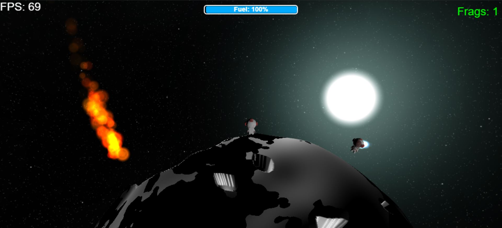

# Fragnauts

A 3D online multiplayer game prototype inspired by Dropzone, featuring combat on tiny random 3D planets. Built with BabylonJS, Firebase realtime database and TypeScript.



[Live Netlify link](https://fragnauts.netlify.app/) 

## Description

Fragnauts is a 3D game prototype where players engage in combat across procedurally generated small planets/asteroids. The game combines tactical gameplay elements inspired by Dropzone with the unique challenge of spherical combat environments.

### Features

- **Multiplayer Combat**: Real-time multiplayer battles with smooth player interpolation
- **Dynamic Planets**: Procedurally generated planets with unique terrain, craters, and surface features
- **Movement System**:
  - Orbital movement mechanics that keep players grounded to the planet
  - Jetpack system with fuel management for vertical mobility
  - Smooth player interpolation for multiplayer synchronization
- **Combat**:
  - Projectile-based combat system
  - Visual effects for hits and deaths
  - Respawn system
- **Camera Systems**:
  - Third-person camera following the player
  - Orbital camera mode for strategic overview
- **Visual Effects**:
  - Particle effects for jetpacks and deaths
  - Dynamic skybox environment
  - 3D player models

## Technologies

- [BabylonJS](https://www.babylonjs.com/) - 3D game engine
- TypeScript - Programming language
- Webpack - Build tool and development server
- Firebase Realtime Database- Online low latency multiplayer functionality

## Getting Started

### Prerequisites

- Node.js (Latest LTS version recommended)

### Installation

1. Clone the repository
2. Install dependencies:
```bash
npm install
```

### Controls

- **WASD**: Move around the planet surface
- **Space**: Activate jetpack
- **Left Mouse Button** or **L**: Shoot
- **C**: Toggle between third-person and orbit camera modes
- **P**: Toggle player debug cube visibility
- **X**: Toggle debug axis visuals

### Development

To start the development server:
```bash
npm start
```
This will open your default browser to `http://localhost:8080`

### Building

To create a production build:
```bash
npm run build
```
The built files will be available in the `dist` directory.

## Project Structure

- `src/index.ts` - Main game logic and initialization
- `src/Player.ts` - Player movement, combat, and physics
- `src/Planet.ts` - Procedural planet generation
- `src/Projectile.ts` - Projectile mechanics and effects
- `src/MultiplayerManager.ts` - Multiplayer synchronization
- `src/firebase.config.ts` - Firebase configuration
- `src/index.html` - HTML template
- `webpack.config.js` - Webpack configuration
- `tsconfig.json` - TypeScript configuration

## License

This project is licensed under the ISC License.